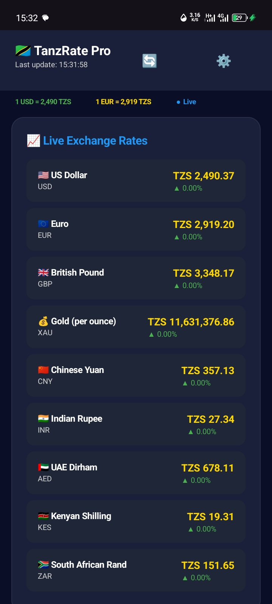

<p align="center">
  
  
  
  
  
</p>

<h1 align="center">🇹🇿 TanzRate Pro</h1>
<p align="center"><strong>Real-time Tanzania Shilling Forex Tracker</strong></p>
<p align="center">
  Live exchange rates · BoT official data · Price alert notifications · Home screen widget · Light & dark themes
</p>

---

## 📱 Screenshots

<p align="center">
  
</p>

---

## ✨ What's New — v2.3.0

| | Feature | Detail |
|---|---|---|
| 🎨 | **Adaptive Themes** | Full light & dark mode — every colour, card, input, and background derives from a single `Theme` inner class |
| 📱 | **Home Screen Widget** | Live USD, EUR, GBP, KES rates on your Android launcher; updates every 30 min via `RateWidget.java` |
| 🔔 | **Rich Notifications** | Price alert hits post a styled notification with custom icon, progress bar, and quick-action buttons |
| 🏦 | **Official BoT Rates** | Buy/sell rates scraped live from [bot.go.tz](https://www.bot.go.tz/ExchangeRate/excRates) via Jsoup |
| ✨ | **Smart Dashboard** | "For You" card learns from your conversion habits and shows trending currency tips |
| ⚙️ | **Custom Dashboard** | Drag-reorder all home screen sections and persist the layout to preferences |
| ⭐ | **Pinned Conversions** | Save frequent conversions as quick-access chips; long-press to remove |
| 💀 | **Skeleton Loading** | Pulsing placeholder cards show while data loads on first launch |
| 🛡️ | **Full Error Handling** | Offline detection, API fallbacks, null-safe UI refs, JSON parse guards everywhere |

---

## 🚀 Features

### 📈 Live Exchange Rates
- Auto-refresh every 1 – 60 minutes (configurable)
- **9 major currencies** vs TZS: USD, EUR, GBP, JPY, CNY, INR, AED, ZAR, KES
- **East African regional** currencies: KES, UGX, RWF, ZAR, AED
- **Precious metals** per troy ounce: Gold (XAU) · Silver (XAG)
- Animated ▲/▼ change indicators with colour flash on each row

### 💱 Smart Currency Converter
- Live real-time calculation as you type (no Convert button needed)
- 14 currencies in both directions with inverse rate display
- One-tap swap with rotation animation
- Quick-amount chips: 10 · 50 · 100 · 500 · 1K · 5K · 10K · 50K
- Copy result to clipboard · Pin favourite conversions · Save to history

### 📊 Markets Tab
- 3×3 currency grid with flag-icon tiles and live rates
- Price alert system — set above/below targets for any currency
- Tap any tile to open an instant conversion dialog

### 🏦 Official Bank of Tanzania Rates
- Live-scraped from [bot.go.tz](https://www.bot.go.tz) using **Jsoup**
- Shows official buy and sell prices in TZS
- Manual refresh with last-updated timestamp
- Clearly sourced — no estimated spreads

### 📱 Home Screen Widget
- Displays USD, EUR, GBP, KES at a glance without opening the app
- Custom `Canvas`-drawn gradient design with gold accents
- Auto-refreshes every 30 minutes · Tap to launch the app

### 🔔 Price Alert Notifications
- Set rate thresholds for any currency (above or below)
- Rich notifications: custom icon, progress bar, action buttons
- Notification channels: alerts (HIGH) · updates (LOW) · widget (MIN)

### 🎨 Light & Dark Themes
- Midnight navy dark mode · Clean white light mode
- Every colour derived from a single `Theme` inner class
- Visual preview tiles in Settings → Appearance

---

## 🗂️ File Structure

```
TanzRate-Pro/
├── TanzaniaForexApp.java          # Main single-Activity app (1 330 lines)
│     ├── class AC                 #   Colour constants
│     ├── class AP                 #   SharedPreferences keys
│     ├── class CM                 #   Currency metadata (codes, flags, symbols)
│     ├── class Theme              #   Full light/dark colour palette
│     └── class BotRate            #   BoT scraped row model
├── AlertNotificationManager.java  # Styled notification builder (260 lines)
├── RateWidget.java                # AppWidgetProvider — Canvas-drawn widget (207 lines)
├── rate_widget_layout.xml         # Widget layout (ImageView container)
├── rate_widget_info.xml           # AppWidgetProviderInfo metadata
├── STORE_LISTING.md               # Full Google Play Store listing + changelog
└── README.md                      # This file
```

---

## ⚙️ Setup

### Requirements
- **Android Studio** or **Sketchware Pro**
- **minSdkVersion 21** (Android 5.0 Lollipop)
- **targetSdkVersion 35**
- Java source compatibility

### Dependencies (add to your build)

```gradle
// Jsoup — for BoT web scraping
implementation 'org.jsoup:jsoup:1.17.2'

// AndroidX Core + Notifications
implementation 'androidx.core:core:1.12.0'
```

### AndroidManifest.xml additions

```xml
<!-- Permissions -->
<uses-permission android:name="android.permission.INTERNET"/>
<uses-permission android:name="android.permission.ACCESS_NETWORK_STATE"/>
<uses-permission android:name="android.permission.POST_NOTIFICATIONS"/>

<!-- Home screen widget receiver -->
<receiver android:name=".RateWidget" android:exported="true">
    <intent-filter>
        <action android:name="android.appwidget.action.APPWIDGET_UPDATE"/>
    </intent-filter>
    <meta-data
        android:name="android.appwidget.provider"
        android:resource="@xml/rate_widget_info"/>
</receiver>
```

### Place XML files
```
res/layout/rate_widget_layout.xml   ← widget ImageView container
res/xml/rate_widget_info.xml        ← widget metadata
```

---

## 🔑 API Keys

> ⚠️ **Move these to `BuildConfig` or a secrets manager before any public release.**

| Service | Used for | Free tier |
|---|---|---|
| [ExchangeRate-API](https://exchangerate-api.com) | Forex rates (14 currencies) | 1 500 req/month |
| [MetalPriceAPI](https://metalpriceapi.com) | Gold & Silver spot prices | 100 req/month |
| [Bank of Tanzania](https://www.bot.go.tz/ExchangeRate/excRates) | Official buy/sell rates | Open web scrape |

---

## 📋 Changelog

### v2.3.0 — Smart, Themed & Widget-Ready *(current)*
- `NEW` Adaptive light/dark theme engine (`Theme` inner class)
- `NEW` Home screen widget (`RateWidget.java` + Canvas Bitmap rendering)
- `NEW` Rich price-alert notifications (`AlertNotificationManager.java`)
- `NEW` Smart "For You" dashboard card with usage-based suggestions
- `NEW` Drag-reorder customisable dashboard layout (persisted to prefs)
- `NEW` Pinned conversions horizontal strip
- `NEW` Skeleton loading animation on first launch
- `FIX` `ClassCastException` crash in metals card — replaced child-index casts with `setTag` / `getTag`
- `FIX` `CompoundButton` lambda compile error — custom `OnToggle` interface
- `FIX` Full offline mode — `isOnline()` check before every network call
- `FIX` All UI refs null-checked; JSON parsing guarded throughout

### v2.2.0 — BoT Scraping & Notifications
- Live BoT rates scraped from bot.go.tz using Jsoup
- `AlertNotificationManager` with channel setup and branded icons
- `setLineSpacingMultiplier` → `setLineSpacing(0f, 1.4f)` compile fix

### v2.1.0 — Converter History & Quick Amounts
- Conversion history (last 20), properly clearable
- Quick-amount chips, clipboard copy, share intent
- Price alerts stored in SharedPreferences JSON
- Surgical UI updates — no full `removeAllViews` rebuild on refresh

### v2.0.0 — Complete Redesign
- Bottom navigation bar (Home / Convert / Markets / Settings)
- Persistent top bar with live rate pills
- Live-as-you-type converter with inverse rate display
- Atomic prefs writes; correct fallback rate loading

### v1.0.0 — Initial Release
- Single-activity forex tracker, 14 currencies vs TZS
- Dark UI, currency converter, trend chart, bank spread table

---

## 🔒 Privacy

- ✅ **No personal data collected**
- ✅ **No account registration**
- ✅ **No analytics or tracking SDKs**
- ✅ **All data stored locally** (SharedPreferences)
- ✅ **Secure HTTPS** for all API calls
- ✅ **No ads · No subscriptions · Completely free**

---

## 📄 License

```
MIT License — Copyright (c) 2026 Willykez

Permission is hereby granted, free of charge, to any person obtaining a copy
of this software to use, copy, modify, merge, publish, distribute and/or sell
copies, subject to the following conditions:

The above copyright notice and this permission notice shall be included in
all copies or substantial portions of the Software.

THE SOFTWARE IS PROVIDED "AS IS", WITHOUT WARRANTY OF ANY KIND.
```

---

## 📬 Contact

**Developer:** Willykez  
**Email:** willykez01@gmail.com  
**Package:** `com.willykez.tanzsx`

---

<p align="center">
  Made with ❤️ in Tanzania 🇹🇿 · If this helped you, please ⭐ the repo!
</p>
